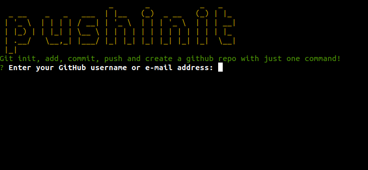

<h3>PUSHINIT </h3>
  

    <b>A Javascript CLI to automate your GIthub flow 👽</b>
  

   
  
   

### Link👨‍💻 :  https://www.npmjs.com/package/pushinit

### Features ✨

**Uses Nodejs  🤠** 

**Github API intigration for user login and creating repository🤖**

**Enhanced UI 🔄** 

**Hosted on NPM🛃**

  <h3>
    Built with ❤️ by
      <a href="https://github.com/agarwalamn">agarwalamn</a>
    
  </h3>

